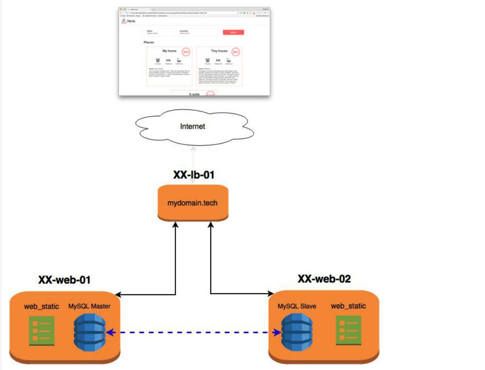

# 0x03. AirBnB clone - Deploy static
## Concepts
For this project, we expect you to look at these concepts:

  * [CI/CD](https://github.com/sintayehuCSE/Concepts/blob/master/concepts43.md)
  * [AirBnB clone](https://github.com/sintayehuCSE/Concepts/blob/master/concepts74.md)

## Background Context

Ever since you completed project [0x0F.Load balancer](https://github.com/sintayehuCSE/alx-higher_level_programming/blob/master/0x0F-python-object_relational_mapping/README-0x0F_Load_balancer.md) of the SysAdmin track, you’ve had 2 web servers + 1 load balancer but nothing to distribute with them.

It’s time to make your work public!

In this first deployment project, you will be deploying your `web_static` work. You will use `Fabric` (for Python3). Fabric is a Python library and command-line tool for streamlining the use of SSH for application deployment or systems administration tasks. It provides a basic suite of operations for executing local or remote shell commands (normally or via `sudo`) and uploading/downloading files, as well as auxiliary functionality such as prompting the running user for input, or aborting execution. This concept is important: execute commands locally or remotely. Locally means in your laptop (physical laptop or inside your Vagrant), and Remotely means on your server(s). Fabric is taking care of all network connections (SSH, SCP etc.), it’s an easy tool for transferring, executing, etc. commands from locale to a remote server.

Before starting, please fork the repository `AirBnB_clone_v2` from your partner if you don’t have it

## Resources
**Read or watch:**
  * [How to use Fabric](https://www.digitalocean.com/community/tutorials/how-to-use-fabric-to-automate-administration-tasks-and-deployments)
  * [How to use Fabric in Python](https://www.pythonforbeginners.com/systems-programming/how-to-use-fabric-in-python)
  * [Fabric and command line options](https://docs.fabfile.org/en/1.13/usage/fab.html)
  * [CI/CD concept page](https://github.com/sintayehuCSE/Concepts/blob/master/concepts43.md)
  * [Nginx configuration for beginners](https://nginx.org/en/docs/beginners_guide.html)
  * [Difference between root and alias on NGINX](https://blog.heitorsilva.com/en/nginx/diferenca-entre-root-e-alias-do-nginx/)
  * [Fabric for Python 3](https://github.com/mathiasertl/fabric)
  * [Fabric Documentation](https://www.fabfile.org/)

## Learning Objectives

At the end of this project, you are expected to be able to explain to anyone, without the help of Google:

**General**
  * What is Fabric
  * How to deploy code to a server easily
  * What is a `tgz` archive
  * How to execute Fabric command locally
  * How to execute Fabric command remotely
  * How to transfer files with Fabric
  * How to manage Nginx configuration
  * What is the difference between `root` and `alias` in a Nginx configuration